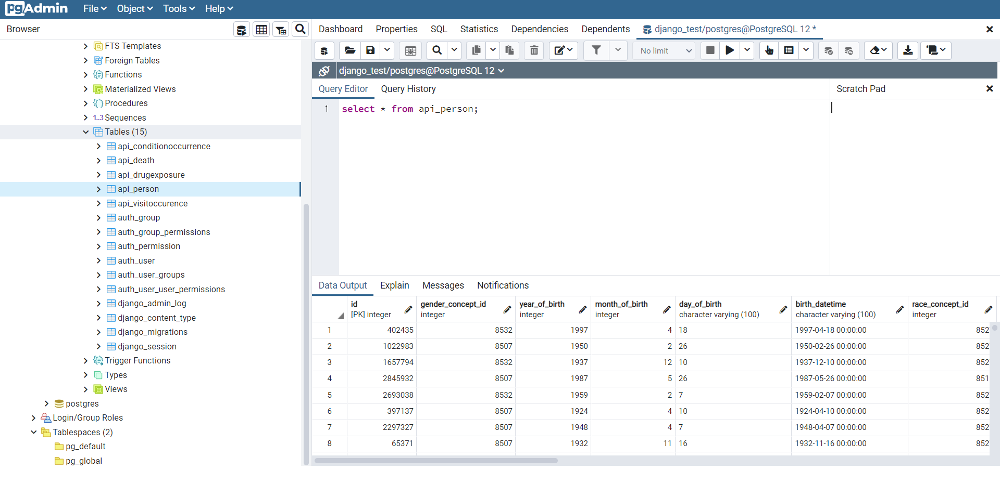

> 사용된 언어 : Python
>
> 라이브러리 : Django

### 1. PostgreSQL을 설치하였고, csv로 제공된 데이터를 테이블로 입력. 성공

### 2. 완료된 API

- http://127.0.0.1:8000/api/persons/ : 등록된 환자에 대한 모든 리스트를 확인 할 수 있다.
- http://127.0.0.1:8000/api/persons/<int:[name='person-list']>  : 환자의 id값을 입력하여 환자의 정보를 확인 할 수 있다.
